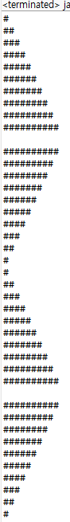
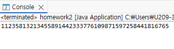
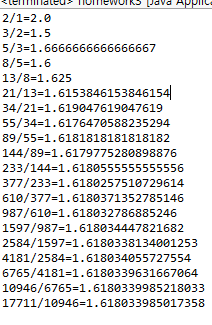
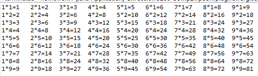

# OOP_JAVA
### Homework1
public class java {
	
	public static void main(String[] args) {
		// TODO Auto-generated method stub
		for(int i=1; i<10; i++) {
			  for(int j = 0; j<=i; j++) {
			    System.out.print("#");
			  }
			  System.out.println("");
		}
		System.out.println("");
	
		for(int i=10; i>=1; i--) {
			for(int j = 0; j<i; j++) {
			    System.out.print("#");
			}
			System.out.println("");
		}
		System.out.print("");

		for(int i=1; i<=10; i++) {
			for(int j = 0; j<10 - i; j++) {
				System.out.print("");
			}
			for(int j = 0; j < i; j++) {
			    System.out.print("#");
			}
			System.out.println("");
		}
		System.out.println("");
	
		for(int i=10; i>=1; i--) {
			for(int j = 0; j<10 - i; j++) {
			    System.out.print("");
			}
			for(int j = 0; j < i; j++) {
			    System.out.print("#");
			}
			System.out.println("");
		}
	}
}

### Homework2
public class homework2 {

	public static void main(String[] args) {
		int n = 20;
		long[] fib = new long[n];
		fib[0] = 1;
		fib[1] = 1;
		for (int i = 2; i < n; i++) {
			fib[i] = fib[i - 1]+ fib[i - 2];
		}
		
		for (int i = 0; i < n; i++) {
			System.out.print(fib[i]);
			if(i != n -1) {
				System.out.print("");
			}
		}
		System.out.println();
	}
}

### homework3
public class homework3 {
	public static void main(String[]args) {
		int n = 22;
		long[]a = new long[n];
		a[0] = 1;
		a[1] = 1;
		
		for (int i = 2; i<n; i++) {
			a[i] = a[i-1]+ a[i-2];
		}
		
		for (int i = 1; i<= 20; i++) {
			double ratio = (double) a[i+1]/ a[i];
			System.out.println(a[i+1]+"/"+a[i]+"="+ratio);
		}
	}
}

### homework4
public class homework4 {
	public static void main(String[]args) {
		for (int dan = 1; dan <=9; dan++) {
			for(int i = 1; i<=9; i++) {
				System.out.printf("%-8s", i +"*"+ dan +"="+(i * dan)+" ");
			}
			System.out.println();
		}
	}
}

