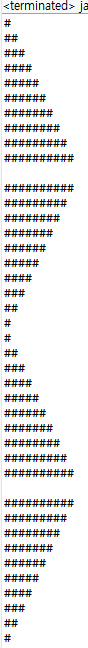
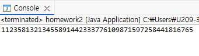
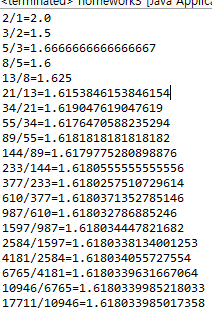
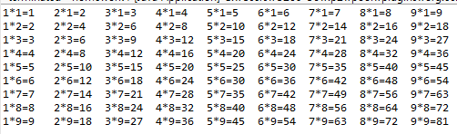
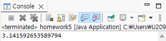
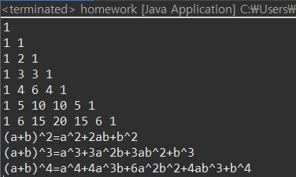
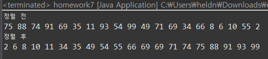
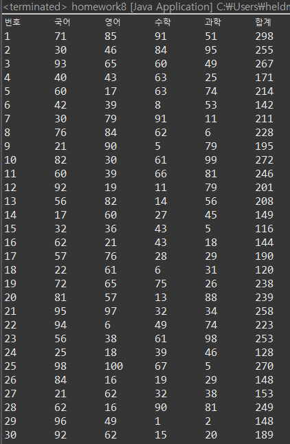

# OOP_JAVA

homework1

	
		for(int i=10; i>=1; i--) {
			for(int j = 0; j<i; j++) {
			    System.out.print("#");
			}
			System.out.println("");
		}
		System.out.print("");

		for(int i=1; i<=10; i++) {
			for(int j = 0; j<10 - i; j++) {
				System.out.print("");
			}
			for(int j = 0; j < i; j++) {
			    System.out.print("#");
			}
			System.out.println("");
		}
		System.out.println("");
	
		for(int i=10; i>=1; i--) {
			for(int j = 0; j<10 - i; j++) {
			    System.out.print("");
			}
			for(int j = 0; j < i; j++) {
			    System.out.print("#");
			}
			System.out.println("");
		}
	}

<\details>

	public static void main(String[] args) {
		int n = 20;
		long[] fib = new long[n];
		fib[0] = 1;
		fib[1] = 1;
		for (int i = 2; i < n; i++) {
			fib[i] = fib[i - 1]+ fib[i - 2];
		}
		
		for (int i = 0; i < n; i++) {
			System.out.print(fib[i]);
			if(i != n -1) {
				System.out.print("");
			}
		}
		System.out.println();
	}

### homework3

	public static void main(String[]args) {
		int n = 22;
		long[]a = new long[n];
		a[0] = 1;
		a[1] = 1;
		
		for (int i = 2; i<n; i++) {
			a[i] = a[i-1]+ a[i-2];
		}
		
		for (int i = 1; i<= 20; i++) {
			double ratio = (double) a[i+1]/ a[i];
			System.out.println(a[i+1]+"/"+a[i]+"="+ratio);
		}

### homework4

	public static void main(String[]args) {
		for (int dan = 1; dan <=9; dan++) {
			for(int i = 1; i<=9; i++) {
				System.out.printf("%-8s", i +"*"+ dan +"="+(i * dan)+" ");
			}
			System.out.println();
		}
	}

### homework5

	public static void main(String[]args){
		int i, n=100, sign=1;
		double sum=0;
		
		for (i=0; i<n; i++) {
			sum +=sign*1./((2.*i+1.)*Math.pow(3.,i));
			sign *=-1;
			}
		
		System.out.println(sum*Math.sqrt(12));
	}

### homework6

	public static  void main(String[]args) {
		int i,j,n=7;
		int binomial[][] = new int [n][n];
		
		for (i=0; i<n;i++) {
			binomial[i][0]=binomial[i][i]=1;
	}
		for (i=2; i<n; i++) {
			for(j=1; j<i;j++) {
				binomial[i][j]=binomial[i-1][j-1]+binomial[i-1][j];
			}
		}
		
		printArray(n, binomial);
		printExpansion(2, binomial);
		printExpansion(3, binomial);
		printExpansion(4, binomial);
	}
	static void printArray(int n, int binomial[][]) {
		int i,j;
		for(i=0;i<n;i++) {
			for (j=0;j<=i; j++){
				System.out.print(binomial[i][j]+" ");
			}
			System.out.println();
		}
	}
	static void printExpansion(int n, int binomial[][]) {
		int k;
		System.out.print("(a+b)^" + n + "=");
		for(k=0;k<=n;k++) {
			if (binomial[n][k]!=1) {
				System.out.print(binomial[n][k]);
			}
			if(n-k==1) {
				System.out.print("a");
			} else if (n-k>1) {
				System.out.print("a^"+(n-k));
			}
			if(k==1) {
				System.out.print("b");
			} else if (k>1) {
				System.out.print("b^"+k);
			}
			if(k<n) {
				System.out.print("+");
			}
		}
		System.out.println();
	}

###homework7

	public static void main(String[] args) {

		int data[] = new int[20];
		for (int i = 0; i < 20; i++)
			data[i] = (int) (Math.random() * 100);

		// 정렬 전 출력
		System.out.println("정렬 전");
		for (int i = 0; i < 20; i++)
			System.out.print(data[i] + " ");
		System.out.println();

		// 선택 정렬
		for (int i = 0; i < 19; i++) {
			int min = i; // 제일 작은 값의 위치

			for (int j = i + 1; j < 20; j++) {
				if (data[j] < data[min])
					min = j; // 더 작은 값을 찾으면 위치 바꾸기
			}

			// data[i]와 data[min] 바꾸기
			int temp = data[i];
			data[i] = data[min];
			data[min] = temp;
		}

		// 정렬 후 출력
		System.out.println("정렬 후");
		for (int i = 0; i < 20; i++)
			System.out.print(data[i] + " ");
		System.out.println();

	}

###homework8 

	public static void main(String[] args) {

		int score[][] = new int[30][4];

		for (int i = 0; i < 30; i++) {
			for (int j = 0; j < 4; j++) {
				score[i][j] = (int) (Math.random() * 101);
			}
		}

		System.out.println("번호\t국어\t영어\t수학\t과학\t합계");

		// 학생별 점수,합계
		for (int i = 0; i < 30; i++) {
			int sum = 0; 

			System.out.print((i + 1) + "\t");
			for (int j = 0; j < 4; j++) {
				System.out.print(score[i][j] + "\t");
				sum = sum + score[i][j];
			}
			System.out.println(sum);
		}

	}

